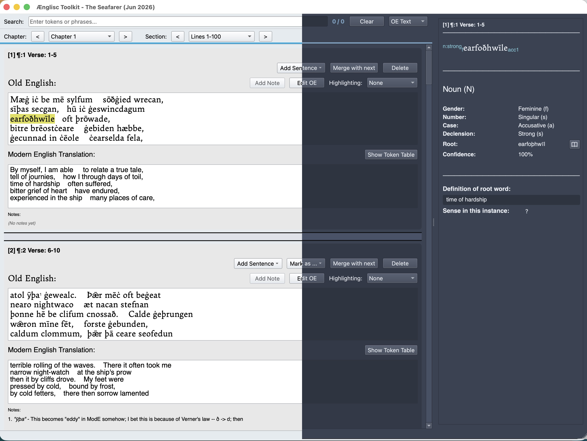

# Ænglisc Toolkit

*A desktop workbench for translating Old English, built for the people doing the translating.*

 

*Main window showing both the light and dark theme.*


You may already be an experienced Old English scholar, or you may be just learning the language.  In either case, you don't need software that guesses at grammar for you — you need a place to keep the source text, your morphological analysis, and your translation in step with each other, without losing your place in a 3,000-line poem.

Ænglisc Toolkit is that place. It doesn't auto-translate and it doesn't auto-annotate: every reading, every case ending, every glossed root is a decision you make. The app's job is to hold all of that together — searchable, exportable, undoable — while you do the linguistics.

## Why this is useful to translators and students

- **Token-by-token morphological annotation** — part of speech, case, number, gender, declension/verb class, and more, with keyboard shortcuts so you're not reaching for a mouse mid-sentence
- **Multi-word idioms** — annotate a phrase as one unit when meaning lives in the phrase, not the head word
- **Incremental annotation** — tag just the part of speech now, come back and fill in the rest later; nothing forces you to finish a token in one pass
- **Remembered annotations** — teach the app your reading of a recurring word once, apply it everywhere, per-project or globally
- **Notes anchored to word spans** — record the scholarly aside without breaking the reading flow
- **Full Translation window** — a side-by-side Old English / Modern English reading view of the whole project, for proofing or presenting your work
- **Publication-quality PDF export** — LaTeX-typeset, footnoted, with an auto-generated glossary of every annotated form
- **DOCX export** — for workflows that live in Word
- **JSON project export/import** — share a project file with a colleague, or move your work between machines
- **Autosave, undo/redo, and automatic backups** — so a slip of the mouse never costs you a session's work

## Installing

The full install and usage guides live in the published documentation: **https://aenglisc-toolkit.readthedocs.io**

- Getting the app (release build or from source): `doc/source/overview/installation.rst`
- Available today: **macOS** (Apple Silicon and Intel)
- Not available yet, planned: Windows and Linux builds

For local development:

```bash
uv sync
python -m oeapp.main
```

See `doc/source/runbook/packaging.rst` for building a standalone `.app`/`.dmg`.

## Contributing

See `doc/source/runbook/contributing.rst` and `doc/source/runbook/coding_standards.rst`.

## License

[MIT](https://opensource.org/license/MIT)
