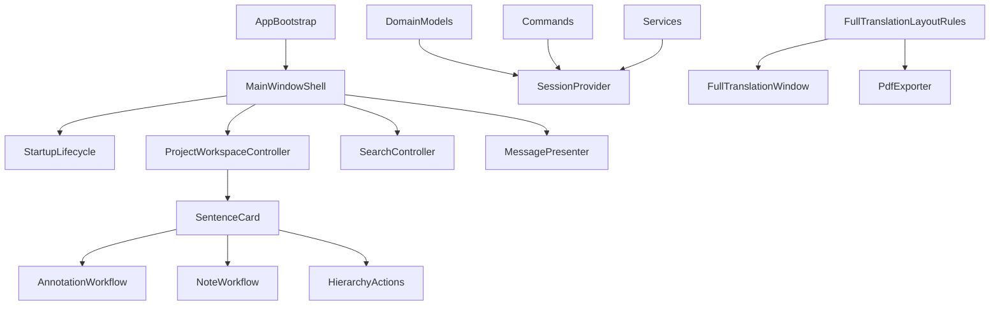

# Ænglisc Toolkit Structural Refactor Plan

## Summary

This plan proposes a behavior-preserving refactor of the `oeapp/` codebase, focused on shrinking orchestration hotspots, hardening architectural boundaries, and improving testability. The work is staged so each phase can land independently with low product risk.

## Problem Frame

The repository already has sensible top-level layers (`models`, `commands`, `services`, `ui`), but several boundaries are soft in practice. A few files and singletons absorb too much coordination work, which makes unrelated changes collide, increases test setup complexity, and raises the cost of future feature work.

## Requirements

- R1. Preserve current end-user behavior and product intent while improving internal structure.
- R2. Reduce coordination load in the largest UI orchestration files.
- R3. Reduce hidden coupling through `ApplicationState` and model-level session lookup.
- R4. Eliminate duplicated full-translation layout rules across UI and PDF export paths.
- R5. Improve testability around bootstrap, global state, help, and keyboard shortcuts.
- R6. Keep each refactor phase independently reviewable and shippable.

## Scope Boundaries

- No feature redesign of the editor, annotation workflow, import/export flows, or help system.
- No database schema redesign.
- No migration from PySide6, SQLAlchemy, or SQLite.
- No broad rewrite of command semantics or undo/redo behavior.

### Deferred to Follow-Up Work

- Packaging/build pipeline cleanup outside what is required for bootstrap seams.
- Large-scale test tree reorganization if it creates too much churn during earlier phases.
- Optional dead-code sweeps beyond the specific modules touched in each phase.

## Context & Research

### Relevant Code and Patterns

- `oeapp/ui/main_window.py` is the main application shell and currently also owns startup, search, import/export, backup, and project workspace coordination.
- `oeapp/ui/sentence_card.py` is the main editor interaction surface and bundles rendering, annotation, note, hierarchy, and sentence CRUD workflows.
- `oeapp/state.py` centralizes session, settings, command manager, and UI messaging.
- `oeapp/models/mixins.py` pulls persistence state from `ApplicationState`, creating hidden model-to-runtime coupling.
- `oeapp/ui/full_translation_window.py` and `oeapp/services/export_pdf.py` duplicate title/paragraph/separator layout rules.
- `tests/conftest.py` and many UI tests show the current testability cost of global state and import-time side effects.

### Institutional Learnings

- Keep layout/output semantics stable while refactoring internals.
- Prefer preserving current interfaces first, then migrating callers incrementally.
- Treat PDF/full-translation rendering as regression-sensitive behavior and protect it with focused tests when extracting shared logic.

## Key Technical Decisions

- Refactor by seam, not by rewrite: keep public behavior stable and preserve existing entry points while extracting narrower collaborators.
- Start with orchestration boundaries before deep domain changes, because `main_window.py`, `sentence_card.py`, and `ApplicationState` currently drive the highest coupling.
- Introduce new shared helpers/services first, then move callers to them, then delete duplicated logic.
- Add small test seams alongside structural changes so refactors can be verified with less mocking over time.

## Open Questions

### Resolved During Planning

- Phase ordering should prioritize low-risk boundary extraction over ambitious redesign.
- The shared full-translation layout rules should become a pure helper/service so both UI and PDF stay aligned.
- `ApplicationState` should be narrowed gradually instead of removed in one step.

### Deferred to Implementation

- Exact class/module names for new controllers and helpers.
- Whether test reorganization into subdirectories should happen as part of Phase 5 or in a later follow-up.
- Whether some command-layer logic should remain in commands versus moving into dedicated workflow services once extraction begins.

## High-Level Technical Design
>
> This illustrates the intended approach and is directional guidance for review, not implementation specification. The implementing agent should treat it as context, not code to reproduce.

## Implementation Units

- U1. **Extract Main Window Coordinators**

**Goal:** Reduce `oeapp/ui/main_window.py` to a composition root and shell by moving startup/workspace/search/message coordination into narrower modules.

**Requirements:** R1, R2, R6

**Dependencies:** None

**Files:**

- Modify: `oeapp/ui/main_window.py`
- Create: `oeapp/ui/main_window_actions.py`
- Create: `oeapp/ui/project_workspace.py`
- Create: `oeapp/ui/messages.py`
- Create: `oeapp/ui/startup_lifecycle.py`
- Test: `tests/test_main_window.py`
- Test: `tests/test_application.py`

**Approach:**

- Keep `MainWindow` public behavior and construction contract intact.
- Move startup/migration/backup flow into a dedicated startup coordinator.
- Move project reload/card wiring/navigation responsibilities into a workspace controller.
- Move message presentation into a small reusable helper.
- Leave thin delegation methods in `MainWindow` during transition so the rest of the app does not need a flag day.

**Patterns to follow:**

- Preserve existing action and signal wiring patterns already used inside `MainWindow`.
- Follow current Qt widget ownership and parent/child lifetime rules.

**Test scenarios:**

- Happy path: creating the main window still initializes startup flow and project workspace without changing user-visible actions.
- Integration: search, import/export, and reload operations still route through the shell and update visible UI state.
- Error path: migration failure and backup-related startup paths still surface the same dialogs/messages.
- Edge case: command history and selected project state survive workspace reloads exactly as before.

**Verification:**

- `oeapp/ui/main_window.py` becomes materially smaller and delegates orchestration concerns to focused modules.
- Existing main-window behavior tests still pass with minimal test rewrites.

---

- U2. **Introduce Session and App Context Seams**

**Goal:** Reduce hidden runtime coupling by replacing model/session lookup through `ApplicationState` with explicit providers at the command/service boundary.

**Requirements:** R1, R3, R6

**Dependencies:** U1

**Files:**

- Modify: `oeapp/state.py`
- Modify: `oeapp/models/mixins.py`
- Modify: `oeapp/commands/abstract.py`
- Modify: `oeapp/db.py`
- Modify: `tests/conftest.py`
- Test: `tests/test_state.py`
- Test: `tests/test_commands.py`
- Test: `tests/test_main_window.py`

**Approach:**

- Introduce a narrow session provider/app context abstraction that can be passed into commands and high-level services.
- Keep `ApplicationState` temporarily as an adapter/facade while callers migrate.
- Make model mixins prefer explicit session flow where available, reducing direct singleton lookup over time.
- Separate UI messaging responsibilities from persistence/session responsibilities in `ApplicationState`.

**Execution note:** characterization-first for undo/redo and session lifecycle behavior.

**Patterns to follow:**

- Preserve current `CommandManager` semantics.
- Follow existing test fixture setup for temporary DB/session handling while reducing singleton assumptions.

**Test scenarios:**

- Happy path: commands still execute with the same session and undo/redo behavior.
- Integration: main window and services can still access session-backed operations without global breakage.
- Error path: missing/unset session cases fail in controlled ways instead of hidden singleton crashes.
- Edge case: tests can create isolated sessions without needing full app bootstrap.

**Verification:**

- Core command/service paths can be exercised in tests with explicit session/context setup.
- `ApplicationState` no longer acts as the only persistence access path.

---

- U3. **Unify Full Translation Layout Rules**

**Goal:** Remove duplicated paragraph/title/separator logic by extracting shared full-translation layout rules used by both UI rendering and PDF export.

**Requirements:** R1, R4, R6

**Dependencies:** None

**Files:**

- Create: `oeapp/services/full_translation_layout.py`
- Modify: `oeapp/ui/full_translation_window.py`
- Modify: `oeapp/services/export_pdf.py`
- Test: `tests/test_full_translation_window.py`
- Test: `tests/test_export_pdf.py`
- Test: `tests/test_full_translation_layout.py`

**Approach:**

- Extract pure helpers for paragraph-start detection, visible-title calculation, and prose/verse separator choice.
- Keep UI-specific text formatting and PDF-specific LaTeX formatting outside the shared helper.
- Add focused regression tests for extracted layout decisions so future rendering changes stay aligned across surfaces.

**Patterns to follow:**

- Preserve current full-translation rendering contract already covered in `tests/test_export_pdf.py` and `tests/test_full_translation_window.py`.

**Test scenarios:**

- Happy path: official chapter/section titles appear at the same sentence boundaries in UI and PDF.
- Edge case: auto titles remain suppressed in both surfaces.
- Edge case: prose-to-verse, verse-to-verse, and paragraph-boundary separators remain consistent.
- Integration: a shared fixture project renders equivalent structural grouping in both window and PDF outputs.

**Verification:**

- Layout-rule duplication is removed from the two rendering surfaces.
- Shared tests clearly lock the cross-surface contract.

---

- U4. **Decompose Sentence Card Workflows**

**Goal:** Reduce the size and change surface of `oeapp/ui/sentence_card.py` by splitting interaction workflows into focused collaborators while preserving the current widget API.

**Requirements:** R1, R2, R6

**Dependencies:** U1

**Files:**

- Modify: `oeapp/ui/sentence_card.py`
- Create: `oeapp/ui/sentence_card_annotation.py`
- Create: `oeapp/ui/sentence_card_notes.py`
- Create: `oeapp/ui/sentence_card_hierarchy.py`
- Create: `oeapp/ui/sentence_card_rendering.py`
- Test: `tests/test_sentence_card.py`
- Test: `tests/test_annotation_modal.py`

**Approach:**

- Keep `SentenceCard` as the public widget and event hub.
- Move annotation-launch/save plumbing, note workflows, hierarchy actions, and rendering/highlighting helpers into smaller modules.
- Preserve existing signals, callbacks, and parent coordination to avoid broad UI churn.

**Patterns to follow:**

- Keep current card-level interactions and integration with token table/sidebar behavior.
- Mirror current dialog-launch and command-dispatch patterns instead of redesigning the UX.

**Test scenarios:**

- Happy path: annotation, note editing, hierarchy actions, and sentence CRUD still work from the card.
- Integration: card interactions still synchronize with token details/sidebar and command history.
- Error path: dialog cancellation and invalid actions leave card state unchanged.
- Edge case: search highlighting and edit-mode transitions remain stable after internal extraction.

**Verification:**

- `oeapp/ui/sentence_card.py` becomes materially smaller and easier to navigate.
- Existing card behavior remains intact through current tests plus targeted collaborator tests.

---

- U5. **Add Bootstrap, Help, and Shortcut Test Seams**

**Goal:** Improve structural safety by adding direct tests and testable seams around app bootstrap, help-engine initialization, and keyboard shortcut registration.

**Requirements:** R1, R5, R6

**Dependencies:** U1, U2

**Files:**

- Modify: `oeapp/main.py`
- Modify: `oeapp/ui/application.py`
- Modify: `oeapp/ui/shortcuts.py`
- Modify: `oeapp/help/help_engine.py`
- Modify: `tests/conftest.py`
- Create: `tests/test_application.py`
- Create: `tests/test_shortcuts.py`
- Create: `tests/test_help_engine.py`

**Approach:**

- Add small construction/registration seams without changing runtime behavior.
- Make shortcut registration inspectable enough for cheap tests plus a few focused `qtbot` behavior checks.
- Add help-engine tests for setup failures and deferred-search/indexing behavior.
- Add a lightweight bootstrap smoke test around application creation and top-level startup flow.

**Patterns to follow:**

- Preserve current Qt app creation behavior and top-level widget initialization flow.
- Keep tests focused on startup contracts and interaction seams rather than full end-to-end UI automation.

**Test scenarios:**

- Happy path: application bootstrap creates the app, loads theme/icon/tray setup, constructs the main window, and schedules the startup dialog.
- Error path: help engine setup failure and missing namespace produce controlled errors/fallback behavior.
- Edge case: deferred help search queues until indexing completes, then replays correctly.
- Integration: critical shortcuts (`Ctrl+F`, undo/redo, modal save/cancel) remain registered and trigger the expected callbacks.

**Verification:**

- Bootstrap/help/shortcut behavior has direct tests instead of only indirect coverage through larger UI suites.
- Test setup requires fewer global patches for these surfaces.

---

- U6. **Optional Test and Module Cleanup Pass**

**Goal:** Consolidate gains from earlier phases by reducing leftover dead code, clarifying test organization, and documenting the new structural boundaries.

**Requirements:** R2, R5, R6

**Dependencies:** U1, U2, U3, U4, U5

**Files:**

- Modify: `tests/conftest.py`
- Modify: `AGENTS.md`
- Modify: `oeapp/services/export_pdf.py`
- Modify: `oeapp/ui/full_translation_window.py`
- Create: `tests/README.md`
- Test: `tests/`

**Approach:**

- Remove obsolete helpers revealed by earlier extractions.
- Decide whether to keep the flat `tests/` layout or move a small first slice into subdirectories if the churn is justified.
- Document new architectural seams and preferred patterns for future work.

**Patterns to follow:**

- Keep cleanup strictly tied to the boundaries introduced in earlier phases.
- Avoid speculative reorganization that does not improve current maintainability.

**Test scenarios:**

- Test expectation: none beyond running the relevant suite and confirming no behavior regressions after cleanup.

**Verification:**

- The repo reflects the new seams clearly enough that future work naturally follows them.
- Cleanup remains bounded and does not become an open-ended rewrite.

## System-Wide Impact

- **Interaction graph:** Main window, sentence card, state/session, and full-translation rendering are the highest-coupling surfaces; each phase intentionally narrows one of those edges.
- **Error propagation:** Startup, migration, help initialization, and command/session failures must continue surfacing through the same user-visible dialogs/messages.
- **State lifecycle risks:** Session ownership, command history preservation, and selected-project UI state are the highest-risk invariants during refactor.
- **API surface parity:** `MainWindow`, `SentenceCard`, `ApplicationState`, and exporter/window entry points should keep stable public behavior while internals move.
- **Integration coverage:** Main-window flows, sentence-card actions, and UI/PDF rendering parity need integration coverage in addition to narrower unit tests.
- **Unchanged invariants:** Undo/redo semantics, project hierarchy behavior, rendering rules, and export/help user-facing capabilities should not change.

## Risks & Dependencies

- Constructor and lifecycle extractions could break startup behavior if not covered with targeted bootstrap tests.
- Session/context changes could introduce subtle persistence bugs if commands and tests are not migrated incrementally.
- Shared layout-rule extraction could drift rendering output if cross-surface regression tests are not added first.
- Large-file decomposition can create temporary duplication during migration; each phase should tolerate short-lived adapters.

## Documentation / Operational Notes

- If rendering/export behavior is intentionally changed during the layout phase, sync help/source docs before regenerating bundled help artifacts.
- Update repo guidance to point future contributors toward the new controller/helper seams once they exist.

## Sources & References

- Related code: `oeapp/ui/main_window.py`
- Related code: `oeapp/ui/sentence_card.py`
- Related code: `oeapp/state.py`
- Related code: `oeapp/models/mixins.py`
- Related code: `oeapp/ui/full_translation_window.py`
- Related code: `oeapp/services/export_pdf.py`
- Related code: `oeapp/ui/application.py`
- Related code: `oeapp/ui/shortcuts.py`
- Related code: `oeapp/help/help_engine.py`
- Related code: `tests/conftest.py`
